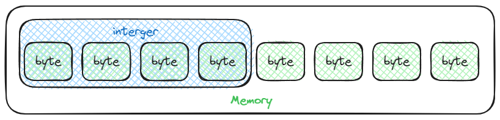
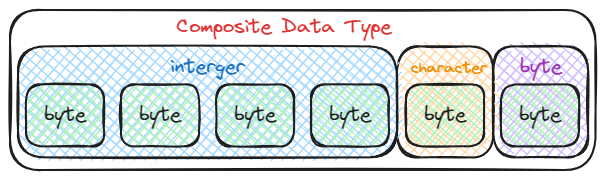

# Data Types

A data type could be thought of a *mermory layout*. It specifies how the data is
stored in memory.

## Primitive Data Types

Primitive data types can be thought of as builtin data types of a language
specification. Some common primitive data types.

> [!Note]
> This does not include the limitations of data types, refer to the respective
> languages for their limitations.

1. Integers

    Similar to the integers in mathematics, it is all positve and negative numbers,
    and zero. This does not include fractional numbers.

2. Unsigned Integers

    Similar to Integers but does not include negative number.

3. Floats

    This data type are integers with support for fractional numbers.

4. Character

    An individual character, glyph, etc.

5. Boolean

    This type's only posible values are true or false

6. Pointers/References

    This type contains addresses in memory, which may be located elsewhere. To
    access the value they point to we need to *dereferrence* (`<ptr>.*`) them.

> [!Important]
> Some languages are type safe, thus defines the pointer as a composite data type
> `*T`, where `T` is the type that the pointer is pointing to.

## Composite Data Type

Composite data types are composed of other data types, which may either be a primitive
data type or another composite data type.

