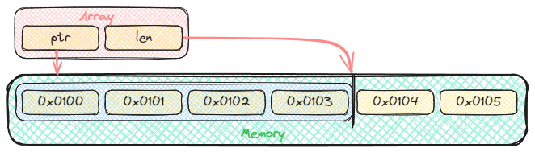
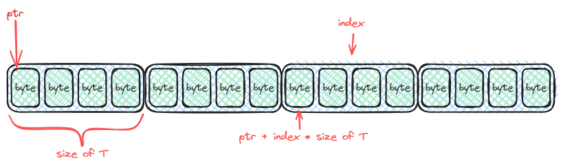

# Array

A data structure that is a contigous block of memory.

> [!Note]
> This data structure is typically implemented as a primitive data type

## Representation

Since an array is a fixed memory region, we can represent it using a pointers.

> [!Note]
> Programming languages may allow for this representation, in most cases
> they will do optimizations causing the array to not be a pointer in the application/
> executable themselves, but rather an allocated memory region.

### Using Pointers



An array has fields `ptr`, which points to a location in memory specifically the
*first element*; and `len`, which dictates the capacity of the array. 

```c
struct Array<T> {
    const ptr: *T,
    const len: unsigned interger,
}
```

Above is a generic representation of an array data structure. `T` is the data type
of each of the elements of the array.

> [!Important]
> Since we have information on `T` on compile time, `T` dictates the amount of
> memory space each elements take.

Assuming that `T` is of type `void`; if we want to store another data type `W`,
we get the size of `W` in **bytes**, times the index of the element we want to
access; then add it to `ptr`.

```c
ptr + index * size_of(W)
```

This is what it looks like.



> [!Note]
> This is ***ASSUMING `T` is VOID***.

## Operations

1. Element Access

    Given an index `i`, and `arr` is an array; access the element in `i` by
    returning `*T`. Throws an error if `i > len`.

    ```rust
    access(arr: Array, i: unsigned interger) -> Error!*T
        if i >= arr.len then
            return Error

        return (arr.ptr + i).*
    ```

    |       | Worst | Average | Best
    | ---   |  ---  |   ---   | ---
    | Time  | `O(1)` | `O(1)` | `O(1)`
    | Space | `O(1)` | `O(1)` | `O(1)`

> [!Note]
> The start index is dependent on the language specification. It may usually start
> at either `0` or `1`. Thus, will determine whether to throw an error at `i >= len`
> (`0`-based indexing) or `i > len` (`1`-based indexing). In the case of the
> pseudocode above, it uses `0`-based indexing.

> [!Tip]
> This operation is usually alias to `arr[i]`

## Variants


## Author


## Referrences


